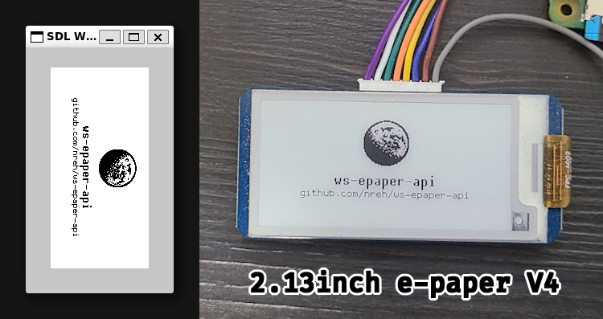
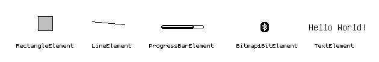

# ws-epaper-api

> [!IMPORTANT]  
> This is an experimental, work-in-progress library that I originally created for my own use. I've made it public, along with
> some documentation, in case it’s helpful to others. However, please note that most displays have not been tested with this
> code and as a result, many display types could be buggy or not run at all.
>
> Please consult
> [Waveshare's own example code](https://github.com/waveshareteam/e-Paper/tree/master/RaspberryPi_JetsonNano/c/examples) for
> your display before proceeding.

A lightweight C++ library for building GUIs on Waveshare e-paper displays with a Raspberry Pi. Includes an SDL-based display
emulator for cross-platform testing without requiring physical hardware. Supports 65 known displays.



<details>

<summary>🔍 Click to see the code for the above image</summary>

## Code for emulation window on the left:

```cpp
#include "emulate.h"
#include "EPD_2in13_V4.h"
#include "wsepaperapi.h"

#include "bitmaps/Moon.h"
#include "fonts/AllFonts.h"

using namespace std;
using namespace epaperapi;

int main() {
    //
    // Initialize emulator and renderer
    //

    typedef devices::EPD_2in13_V4::EPD_2in13_V4_DrawTarget device;
    EpaperEmulator target = EpaperEmulator::CreatePhysical<device>();
    Renderer renderer(target, BufferTransform::Rotate90Clockwise);

    //
    // Define fonts
    //

    typedef fonts::DinaBold_10pt font1;
    typedef fonts::Dina_6pt font2;

    //
    // Create and position elements
    //

    elements::TextElement<font1> text1("ws-epaper-api");
    text1.foregroundStyle.SetBlackChannel(0);
    text1.xpos = (250 / 2) - (text1.GetWidth() / 2);
    text1.ypos = 70;
    text1.characterSpacing = 0;
    renderer.AddElement(&text1);

    elements::TextElement<font2> text2("github.com/nreh/ws-epaper-api");
    text2.foregroundStyle.SetBlackChannel(0);
    text2.xpos = (250 / 2) - (text2.GetWidth() / 2);
    text2.ypos = text1.GetHeight() + text1.ypos;
    text2.characterSpacing = 0;
    renderer.AddElement(&text2);

    auto t = bitmaps::Moon();
    elements::Bitmap1BitElement img((250 / 2) - (t.GetWidth() / 2), 15, &t);
    renderer.AddElement(&img);

    //
    // Render!
    //

    renderer.Refresh();
    KeepWindowOpen();
}
```

## Code for physical display on the right:

```cpp
#include "EPD_2in13_V4.h"
#include "wsepaperapi.h"

#include "bitmaps/Moon.h"
#include "fonts/AllFonts.h"

using namespace std;
using namespace epaperapi;

int main() {
    //
    // Initialize device and renderer
    //

    devices::EPD_2in13_V4::EPD_2in13_V4_DrawTarget dev;
    Renderer renderer(dev, BufferTransform::Rotate90Clockwise);

    //
    // Initialize the display registers and clear to white
    //

    dev.Clear();

    //
    // Define fonts
    //

    typedef fonts::DinaBold_10pt font1;
    typedef fonts::Dina_6pt font2;

    //
    // Create and position elements
    //

    elements::TextElement<font1> text1("ws-epaper-api");
    text1.foregroundStyle.SetBlackChannel(0);
    text1.xpos = (250 / 2) - (text1.GetWidth() / 2);
    text1.ypos = 70;
    text1.characterSpacing = 0;
    renderer.AddElement(&text1);

    elements::TextElement<font2> text2("github.com/nreh/ws-epaper-api");
    text2.foregroundStyle.SetBlackChannel(0);
    text2.xpos = (250 / 2) - (text2.GetWidth() / 2);
    text2.ypos = text1.GetHeight() + text1.ypos;
    text2.characterSpacing = 0;
    renderer.AddElement(&text2);

    auto t = bitmaps::Moon();
    elements::Bitmap1BitElement img((250 / 2) - (t.GetWidth() / 2), 15, t);
    renderer.AddElement(&img);

    //
    // Render!
    //

    renderer.Refresh();

    //
    // Put device to sleep and exit
    //

    dev.Sleep();
    // According to waveshare's example code, we require a 2 second
    // delay between sleeping and exitting the device.
    devices::interface::bcm2835_delay(2000);
    dev.Exit();
}
```

</details>

&nbsp;

> [!NOTE]  
> See **[Examples Directory](examples)** for detailed examples on using the library.

&nbsp;

## ⭐ Features



- UI elements for creating complex interfaces
- Display emulation to test without a physical e-paper display
- Pixel perfects fonts for displaying text and scripts for creating your own
- Easily extensible for custom displays as well as your own UI elements

## 🔗 Quick Links:

1. [I want to use this library in my C++ project](#-use-in-your-c-project)
2. [I want to build the examples](#-build-the-examples)
3. [I want to build as a library](#-build-the-library)
4. [Is my display supported?](#-supported-displays)

&nbsp;

&nbsp;

## ⚡ Use in your C++ Project

In your CMakeLists.txt simply add the directory containing all the source code here and link it with your executable.

```
git clone https://github.com/nreh/ws-epaper-api
```

```cmake
add_subdirectory(ws-epaper-api)
target_link_libraries(your_executable PRIVATE ws-epaper-api)
```

For example, this is what a simple CMakeLists.txt could look like:

```cmake
cmake_minimum_required(VERSION 3.14)

project(
    "my_test_program"
    LANGUAGES C CXX
)

add_executable(my_test_program src/main.cpp)

add_subdirectory(extern/ws-epaper-api)
target_link_libraries(my_test_program PRIVATE ws-epaper-api)
```

Then import the required header file:

```cpp
#include "wsepaperapi.h"
```

And finally the headerfile corresponding to your display. A complete list of header files that you can import can be found in
[`external/waveshare/DrawTargets`](external/waveshare/DrawTargets).
[For example, if you have this display](https://www.waveshare.com/2.13inch-e-paper-hat.htm), you'd import:

```cpp
#include "EPD_2in13_V4.h"
```

> [!IMPORTANT]  
> To use the emulation feature, the `ENABLE_EMULATION` option must be set to TRUE or ON. In addition, you must have the SDL
> library installed on your machine where CMake can find it.
>
> Once enabled, you can get the required functions/classes for emulation by important `emulate.h`:
>
> ```cpp
> #include "wsepaperapi.h"
> #include "emulate.h"
> ```
>
> See the examples for more information.

On Windows, the compiled executable will not be runnable without `SDL2.dll` and `ws-epaper-api.dll` in the same directory.
You can automatically copy them over to the executable's directory with the following addition to your CMakeLists.txt:

```cmake
add_custom_command(TARGET ${PROJECT_NAME} POST_BUILD
    COMMAND ${CMAKE_COMMAND} -E copy -t $<TARGET_FILE_DIR:${PROJECT_NAME}> $<TARGET_RUNTIME_DLLS:${PROJECT_NAME}>
    COMMAND_EXPAND_LISTS
)
```

&nbsp;

## 🔨 Build the Examples

```
mkdir build
cd build
cmake -DBUILD_EXAMPLES=TRUE -DENABLE_EMULATION=TRUE ..
cmake --build .
```

The resulting executable binaries will be located in the `build/examples/` directory.

&nbsp;

## 🔨 Build the Library

### Shared Library

This will build the project as a **shared** library

```
mkdir build
cd build
cmake ..
cmake --build .
```

### Static Library

Set `WSEPAPERAPI_STATIC` to TRUE to build as a **static** library.

```
mkdir build
cd build
cmake .. -DWSEPAPERAPI_STATIC=TRUE
cmake --build .
```

&nbsp;

### ✅ Supported Displays

The table below shows which displays are supported and what they were categorized as by the automated script. Note that some
of these may be incorrectly categorized.

| Display Name               | Headerfile         | Width | Height | Type            | Supported Colors                                      | Supported? |
| :------------------------- | :----------------- | ----: | -----: | :-------------- | :---------------------------------------------------- | :--------- |
| EPD 5.79 inch g            | EPD_5in79g.h       |   792 |    272 | Color2BitEPD    | ['black', 'yellow', 'red']                            | Yes        |
| 7.3inch e-Paper (F) Driver | EPD_7in3f.h        |   800 |    480 | 7Color4BitEPD   | ['black', 'red', 'green', 'blue', 'yellow', 'orange'] | Yes        |
| 2.9inch e-paper b V3       | EPD_2in9b_V3.h     |   128 |    296 | RedBlack1BitEPD | ['black', 'red']                                      | Yes        |
| 2.13inch e-paper B V4      | EPD_2in13b_V4.h    |   122 |    250 | RedBlack1BitEPD | ['black', 'red']                                      | Yes        |
| 4.2inch e-paper b&c V1.0   | EPD_4in2b_V2.h     |   400 |    300 | RedBlack1BitEPD | ['black', 'red']                                      | Yes        |
| 10.2inch b e-paper         | EPD_10in2b.h       |   960 |    640 | RedBlack1BitEPD | ['black', 'red']                                      | Yes        |
| 5.65inch e-paper           | EPD_5in65f.h       |   600 |    448 | 7Color4BitEPD   | ['black', 'green', 'blue', 'red', 'yellow', 'orange'] | Yes        |
| 4.01inch e-paper           | EPD_4in01f.h       |   640 |    400 | 7Color4BitEPD   | ['black', 'red', 'green', 'blue', 'yellow', 'orange'] | Yes        |
| 2.36inch e-Paper (G)       | EPD_2in36g.h       |   168 |    296 | Color2BitEPD    | ['black', 'yellow', 'red']                            | Yes        |
| 7.3inch e-Paper (F)        | EPD_7in3e.h        |   800 |    480 | 6Color4BitEPD   | ['black', 'red', 'yellow', 'blue', 'green']           | Yes        |
| 5.83inch e-paper V2        | EPD_5in83_V2.h     |   648 |    480 | Black1BitEPD    | ['black']                                             | Yes        |
| 2.7inch V2 e-paper         | EPD_2in7_V2.h      |   176 |    264 | Black1BitEPD    | ['black']                                             | Yes        |
| 1.54inch e-paper b V2      | EPD_1in54b_V2.h    |   200 |    200 | RedBlack1BitEPD | ['black', 'red']                                      | Yes        |
| 2.7inch e-paper b          | EPD_2in7b.h        |   176 |    264 | RedBlack1BitEPD | ['black', 'red']                                      | Yes        |
| 5.83inch e-paper b&c       | EPD_5in83bc.h      |   600 |    448 | RedBlack1BitEPD | ['black', 'red']                                      | Yes        |
| 1.54inch e-paper b         | EPD_1in54b.h       |   200 |    200 | RedBlack1BitEPD | ['black', 'red']                                      | Yes        |
| 4.2inch e-paper b&c        | EPD_4in2bc.h       |   400 |    300 | RedBlack1BitEPD | ['red', 'black']                                      | Yes        |
| 2.15inch e-paper b         | EPD_2in15b.h       |   160 |    296 | RedBlack1BitEPD | ['black', 'red']                                      | Yes        |
| 7.5inch e-paper HD         | EPD_7in5b_HD.h     |   880 |    528 | RedBlack1BitEPD | ['black', 'red']                                      | Yes        |
| 2.66inch e-paper b         | EPD_2in66b.h       |   152 |    296 | RedBlack1BitEPD | ['black', 'red']                                      | Yes        |
| 5.79inch e-paper V1.0      | EPD_5in79b.h       |   792 |    272 | RedBlack1BitEPD | ['black', 'red']                                      | Yes        |
| 2.9inch e-paper b&c V3.0   | EPD_2in9bc.h       |   128 |    296 | RedBlack1BitEPD | ['black', 'red']                                      | Yes        |
| 13.3inch e-paper (B) V1.0  | EPD_13in3b.h       |   960 |    680 | RedBlack1BitEPD | ['black', 'red']                                      | Yes        |
| 2.9inch e-paper b V4       | EPD_2in9b_V4.h     |   128 |    296 | RedBlack1BitEPD | ['red', 'black']                                      | Yes        |
| 1.54inch e-paper c         | EPD_1in54c.h       |   152 |    152 | RedBlack1BitEPD | ['black', 'red']                                      | Yes        |
| 2.13inch e-paper b V3      | EPD_2in13b_V3.h    |   104 |    212 | RedBlack1BitEPD | ['black', 'red']                                      | Yes        |
| 2.7inch e-paper V2         | EPD_2in7b_V2.h     |   176 |    264 | RedBlack1BitEPD | ['black', 'red']                                      | Yes        |
| 2.13inch e-paper b&c       | EPD_2in13bc.h      |   104 |    212 | RedBlack1BitEPD | ['black', 'red']                                      | Yes        |
| 4.37inch e-paper b         | EPD_4in37b.h       |   176 |    480 | RedBlack1BitEPD | ['black', 'red']                                      | Yes        |
| 5.83inch e-paper           | EPD_5in83.h        |   600 |    448 | Black1BitEPD    | ['black']                                             | Yes        |
| 1.54inch DES e-paper V1.0  | EPD_1in54_DES.h    |   152 |    152 | Black1BitEPD    | ['black']                                             | Yes        |
| 7.5inch e-paper V2         | EPD_7in5_V2.h      |   800 |    480 | Black1BitEPD    | ['black']                                             | Yes        |
| 1.02inch e-paper           | EPD_1in02d.h       |    80 |    128 | Black1BitEPD    | ['black']                                             | Yes        |
| 2.13inch e-paper V2 V3.0   | EPD_2in13_V2.h     |   122 |    250 | Black1BitEPD    | ['black']                                             | Yes        |
| 13.3inch e-paper (K)       | EPD_13in3k.h       |   960 |    680 | Black2BitEPD    | ['black']                                             | Yes        |
| 3.7inch e-paper            | EPD_3in7.h         |   280 |    480 | Black2BitEPD    | ['black']                                             | Yes        |
| 2.9inch e-paper V2         | EPD_2in9_V2.h      |   128 |    296 | Black2BitEPD    | ['black']                                             | Yes        |
| 2.7inch e-paper            | EPD_2in7.h         |   176 |    264 | Black2BitEPD    | ['black']                                             | Yes        |
| 4.2inch e-paper            | EPD_4in2.h         |   400 |    300 | Black2BitEPD    | ['black']                                             | Yes        |
| 4.26inch e-paper           | EPD_4in26.h        |   800 |    480 | Black2BitEPD    | ['black']                                             | Yes        |
| 4.2inch e-paper V2 V1.0    | EPD_4in2_V2.h      |   400 |    300 | Black2BitEPD    | ['black']                                             | Yes        |
| 2.66inch e-Paper (G)       | EPD_2in66g.h       |   184 |    360 | Color2BitEPD    | ['black', 'yellow', 'red']                            | Yes        |
| 4.37inch e-Paper G V1.0    | EPD_4in37g.h       |   512 |    368 | Color2BitEPD    | ['black', 'red', 'yellow']                            | Yes        |
| 2.13inch e-paper G         | EPD_2in13g.h       |   122 |    250 | Color2BitEPD    | ['black', 'yellow', 'red']                            | Yes        |
| 3inch e-paper G            | EPD_3in0g.h        |   168 |    400 | Color2BitEPD    | ['black', 'yellow', 'red']                            | Yes        |
| 7.3inchg e-paper G         | EPD_7in3g.h        |   800 |    480 | Color2BitEPD    | ['black', 'yellow', 'red']                            | Yes        |
| 2inch15 e-paper (G)        | EPD_2in15g.h       |   160 |    296 | Color2BitEPD    | ['black', 'yellow', 'red']                            | Yes        |
| 1.64inch e-paper(G)        | EPD_1in64g.h       |   168 |    168 | Color2BitEPD    | ['black', 'yellow', 'red']                            | Yes        |
| 2.13inch e-paper V3        | EPD_2in13.h        |   122 |    250 | Black1BitEPD    | ['black']                                             | Yes        |
| 2.13inch e-paper d         | EPD_2in13d.h       |   104 |    212 | Black1BitEPD    | ['black']                                             | Yes        |
| 2.9inch e-paper d          | EPD_2in9d.h        |   128 |    296 | Black1BitEPD    | ['black']                                             | Yes        |
| 2.13inch e-paper V3        | EPD_2in13_V3.h     |   122 |    250 | Black1BitEPD    | ['black']                                             | Yes        |
| 2.13inch e-paper V4        | EPD_2in13_V4.h     |   122 |    250 | Black1BitEPD    | ['black']                                             | Yes        |
| EPD 7.5 inch HD            | EPD_7in5_HD.h      |   880 |    528 | Black1BitEPD    | ['black']                                             | Yes        |
| 1.54inch e-paper V2        | EPD_1in54_V2.h     |   200 |    200 | Black1BitEPD    | ['black']                                             | Yes        |
| 1.54inch e-paper           | EPD_1in54.h        |   200 |    200 | Black1BitEPD    | ['black']                                             | Yes        |
| 5.84inch e-paper           | EPD_5in84.h        |   768 |    256 | Black1BitEPD    | ['black']                                             | Yes        |
| 2.9inch e-paper            | EPD_2in9.h         |   128 |    296 | Black1BitEPD    | ['black']                                             | Yes        |
| 5.79inch e-paper           | EPD_5in79.h        |   792 |    272 | Black1BitEPD    | ['black']                                             | Yes        |
| 2.66inch e-paper           | EPD_2in66.h        |   152 |    296 | Black1BitEPD    | ['black']                                             | Yes        |
| 3.52inch e-paper           | EPD_3in52.h        |   240 |    360 | Black1BitEPD    | ['black']                                             | Yes        |
| 7.5inch e-paper            | EPD_7in5.h         |   640 |    384 | Black1BitEPD    | ['black']                                             | Yes        |
| 2.13inch DES e-paper       | EPD_2in13_DES.h    |   104 |    212 | Black1BitEPD    | ['black']                                             | Yes        |
| 2.9inch DES e-paper        | EPD_2in9_DES.h     |   128 |    296 | Black1BitEPD    | ['black']                                             | Yes        |
| 5.83inch e-paper V2        | EPD_5in83b_V2.h    |   648 |    480 | RedBlack1BitEPD | ['red', 'black']                                      | Yes        |
| 4.2inch e-paper b&c        | EPD_4in2b_V2_old.h |   400 |    300 | NoExampleFile   | ['black', 'red']                                      | No         |
| 7.5inch e-paper V2         | EPD_7in5_V2_old.h  |   800 |    480 | NoExampleFile   | ['black']                                             | No         |
| 4inch e-Paper E            | EPD_4in0e.h        |   400 |    600 | NoExampleFile   | ['black', 'yellow', 'red', 'blue', 'green']           | No         |
| 7.5inch e-paper V2         | EPD_7in5b_V2_old.h |   800 |    480 | NoExampleFile   | ['black', 'red']                                      | No         |
| 7.5inch e-paper b&c        | ~~EPD_7in5bc.h~~   |   640 |    384 | Unknown         | ['black', 'red', 'yellow']                            | No         |
| 7.5inch e-paper B V2       | ~~EPD_7in5b_V2.h~~ |   800 |    480 | Unknown         | ['black', 'red', 'yellow']                            | No         |

Displays marked as 'NoExampleFile' are generally not supported because of a missing example file in Waveshare's code making
it difficult for the automated script to accurately categorize.
